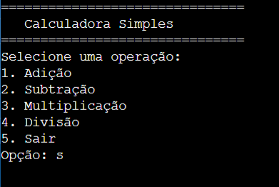

# Calculadora em C
- Este projeto trata de uma calculadora em código C que funciona pelo terminal. 
- Ela realiza as 4 principais operações matemáticas (adição, subtração, multiplicação e divisão).

# Visualização
Apresentação visual do Projeto:


# Instalação e Pré-Requisitos
- Instale por aqui a sua versão do código;
- Para rodar, é necessário que sua máquina seja capaz de rodar arquivos em C;
- Recomendo fortemente o VSCode, ele é legal.

# Exemplos de Comando
**Para fazer com que a calculadora fucnione, você deve:**
- Rodar, obviamente;
- Escolher qual opção você quer (será apresentado um menu de imediato);
- Fazer a operação que deseja!

# Estrutura do Projeto

```
│── LICENSE
│── README.md
│── main.c

- License descreverá a natureza da licensa deste projeto, portanto, leia!
- Readme.md é este arquivo que vossa senhoria está lendo;
- main.c é o principal código, é nele que está contido todo o código necessário para que o projeto funcione;

